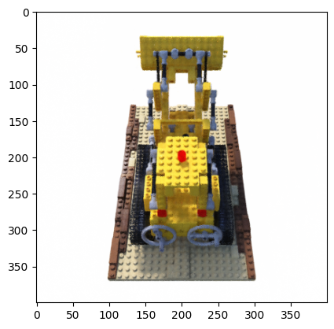
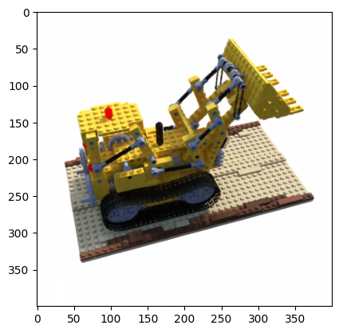
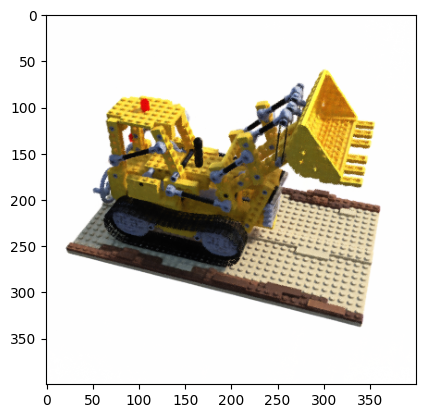
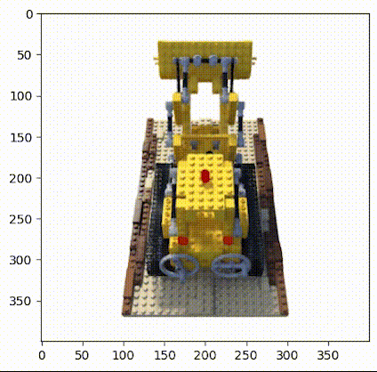

# NeRF Model Implementation

This project implements the Neural Radiance Fields (NeRF) model, which creates or predicts a 3D scene of an object using some 2D images.

## Overview

NeRF is a method for representing 3D scenes based on 2D images. It can generate high-quality views of complex 3D scenes by optimizing a continuous volumetric scene function using a sparse set of 2D images. The original NeRF paper can be found [here](https://arxiv.org/abs/2003.08934).

## Getting Started

### Prerequisites

To run this project, you'll need to install the required dependencies. First, download the necessary packages using the `requirements.txt` file:

```bash
pip install -r requirements.txt
```


### CUDA and PyTorch

To leverage GPU acceleration with CUDA, ensure you download the correct version of PyTorch compatible with your device's CUDA version. Visit the [official PyTorch website](https://pytorch.org/get-started/locally/) and follow the instructions to install the appropriate version.

### Dataset

Download the datasets from the following Google Drive link:

[Dataset Download Link](https://drive.google.com/drive/folders/18bwm-RiHETRCS5yD9G00seFIcrJHIvD-?usp=sharing)


### Running the Model

The main script for running the model is `nerf.py`. To train the model, use the following command:

```bash
python nerf.py
```
Training the model requires approximately 5 to 8 hours on an RTX 2080 Ti GPU. The final results will be stored in the `novel_views` directory.

### Data Preprocessing

The datasets were generated and preprocessed using the code from `kwea123/nerf_pl`. The training hyperparameters were also retrieved from `kwea123/nerf_pl`.

### References

This project includes code and ideas from the following repositories:

- [MaximeVandegar's GitHub](https://github.com/MaximeVandegar)
- [kwea123's GitHub](https://github.com/kwea123)

### Some Results

Here are some of the output Novel Views genrated from this script.






Final Result




